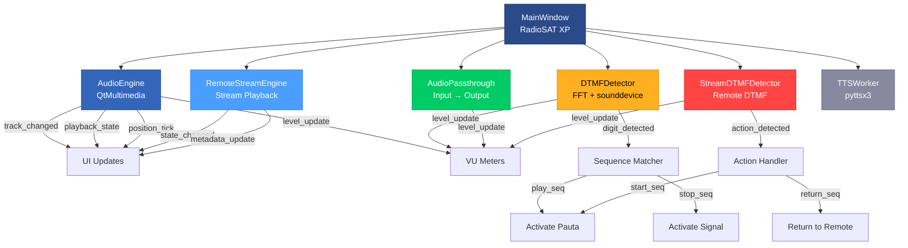
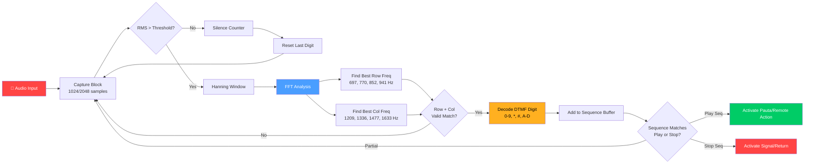
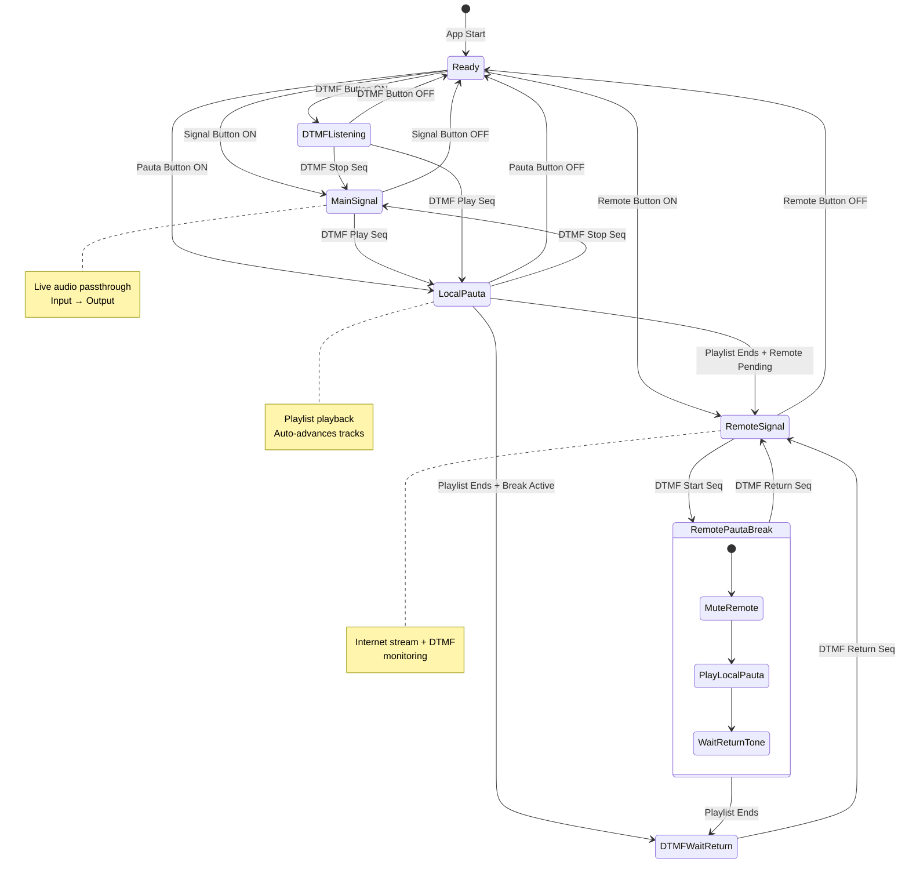
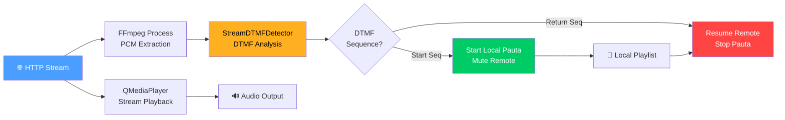
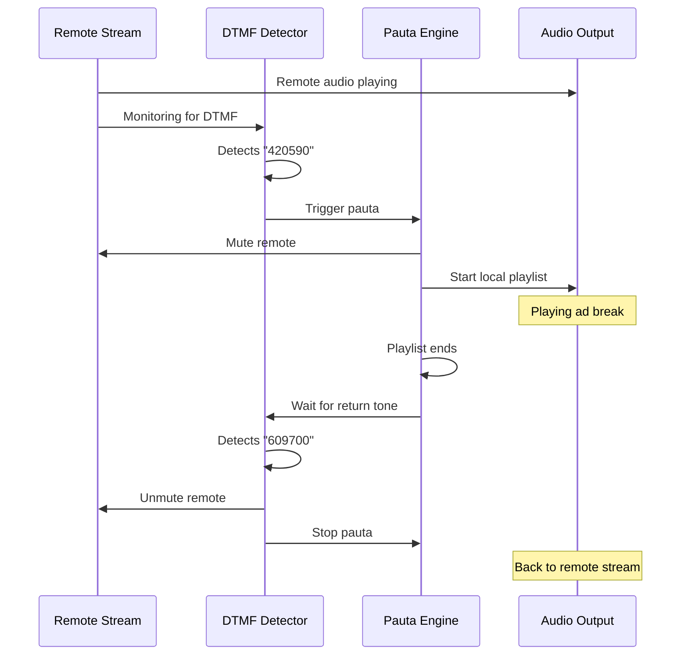

# RadioSAT XP - Radio Automation Suite


> **Professional radio automation suite** with a nostalgic Windows XP aesthetic. Real-time audio playback, DTMF tone detection, live streaming, playlist management, and broadcast control — all in one application.


---

## Table of Contents

- [Description](#description)
- [Features](#features)
- [Architecture](#architecture)
- [Main Workflow](#main-workflow)
- [DTMF Detection](#dtmf-detection)
- [System States](#system-states)
- [Installation](#installation)
- [Usage Guide](#usage-guide)
  - [Console Panel](#-console-panel)
  - [DTMF Configuration](#-dtmf-configuration)
  - [Player & Playlist](#-player--playlist)
  - [Media Library](#-media-library)
  - [Audio Control](#-audio-control)
  - [Main Signal](#-main-signal-senal-principal)
  - [Remote Signal](#-remote-signal-senal-remota)
  - [Local Break](#-local-break-pauta-local)
- [Theme System](#theme-system)
- [Data Persistence](#data-persistence)
- [Dependencies](#dependencies)
- [License](#license)
- [Versión en Español](#versión-en-español)

---

## Description

RadioSAT XP is a complete radio broadcast automation system built with **PyQt6**. It combines real-time audio processing, DTMF tone detection for remote triggering, playlist management, and live streaming support — all wrapped in a beautiful Windows XP-inspired interface with original XP icons.

### Use Cases

- **Community Radio Stations** — Automate music, ads, and live programming
- **Internet Radio** — Manage streaming playlists with remote control
- **Broadcast Engineering** — DTMF-triggered automation for remote sites
- **Podcast Production** — Audio playback with professional controls

---

## Features

| Feature | Icon | Description |
|---------|------|-------------|
| **Audio Playback** |  | Play, pause, stop, next, previous with QtMultimedia |
| **DTMF Detection** |  | Real-time FFT-based DTMF tone decoding |
| **VU Meters** |  | Animated 60 FPS level meters with peak hold |
| **Playlist Manager** |  | Add, remove, reorder, save/load M3U files |
| **Media Library** |  | Import folders, search, filter by artist/title/album |
| **Microphone** |  | ON/OFF mute with real-time monitoring |
| **Volume Control** |  | Multiple independent volume sliders |
| **TTS** |  | Text-to-Speech via pyttsx3 |
| **Live Clock** |  | Real-time HH:MM:SS display |
| **Remote Streaming** |  | Play internet radio streams with DTMF control |
| **Audio Passthrough** |  | Live mic-to-output signal routing |
| **Ad Scheduling** |  | Scheduled ad breaks with auto-return |
| **Dark/Light Theme** |  | Switchable dark and light UI themes |
| **XP Icons** |  | Original Windows XP icon set throughout the UI |

---

## Architecture



### Component Overview

| Component | Purpose | Thread |
|-----------|---------|--------|
| `AudioEngine` | Local file/stream playback via QMediaPlayer | Main (Qt) |
| `DTMFDetector` | Captures mic input, decodes DTMF via FFT | Background |
| `AudioPassthrough` | Routes mic input to audio output in real-time | Background |
| `RemoteStreamEngine` | Plays remote HTTP streams | Main (Qt) |
| `StreamDTMFDetector` | Analyzes remote audio for DTMF via FFmpeg | Main (Qt) |
| `TTSWorker` | Text-to-Speech in isolated thread | QThread |

---

## Main Workflow


---

## DTMF Detection

RadioSAT uses **dual-tone multi-frequency signaling (DTMF)** to remotely trigger actions. This is commonly used in radio broadcasting for remote control of automation systems.

### How It Works



### DTMF Frequency Matrix

| | **1209 Hz** | **1336 Hz** | **1477 Hz** | **1633 Hz** |
|---|:---:|:---:|:---:|:---:|
| **697 Hz** | 1 | 2 | 3 | A |
| **770 Hz** | 4 | 5 | 6 | B |
| **852 Hz** | 7 | 8 | 9 | C |
| **941 Hz** | * | 0 | # | D |

### Default Trigger Sequences

| Sequence | Action |
|----------|--------|
| `420590` | Start Pauta Local (ad break) |
| `609700` | Stop Pauta / Return to Signal |

These can be customized in the **DTMF Configuration** panel.

---

## System States



### State Descriptions

| State | LED | Description |
|-------|-----|-------------|
| **Ready** | 🟢 Green | System idle, waiting for input |
| **Main Signal** | 🔴 Red | Live audio passthrough active (ON AIR) |
| **Local Pauta** | 🟢 Green | Playing local playlist (ads/music) |
| **Remote Signal** | 🔵 Blue | Remote stream playing with DTMF monitoring |
| **DTMF Listening** | 🟡 Amber | Microphone active, detecting DTMF tones |

---

## Installation

### Prerequisites

- **Python 3.10+**
- **FFmpeg** (required for remote stream DTMF detection)
- **PortAudio** (required by sounddevice)

### macOS

```bash
# Install Homebrew dependencies
brew install python ffmpeg portaudio

# Clone the repository
git clone https://github.com/danielrodrigohub/radiosat.git
cd radiosat

# Create virtual environment
python3 -m venv .venv
source .venv/bin/activate

# Install Python dependencies
pip install PyQt6 numpy sounddevice mutagen pyttsx3

# Run RadioSAT
python main.py
```

### Windows

```bash
# Install Python from python.org
# Install FFmpeg from ffmpeg.org and add to PATH

# Clone and setup
git clone https://github.com/danielrodrigohub/radiosat.git
cd radiosat

python -m venv .venv
.venv\Scripts\activate

pip install PyQt6 numpy sounddevice mutagen pyttsx3

python main.py
```

### Linux (Ubuntu/Debian)

```bash
sudo apt update
sudo apt install python3 python3-venv ffmpeg portaudio19-dev

git clone https://github.com/danielrodrigohub/radiosat.git
cd radiosat

python3 -m venv .venv
source .venv/bin/activate

pip install PyQt6 numpy sounddevice mutagen pyttsx3

python main.py
```

---

## Usage Guide

### Main Window Layout

The RadioSAT interface is organized into 5 main panels:

```
┌─────────────────┬──────────────────┬──────────────────┐
│   CONSOLE       │  DTMF CONFIG     │  PLAYER &        │
│   (Clock, LEDs, │  (Devices,       │  PLAYLIST        │
│    Controls)    │   Parameters)    │  (Transport,     │
│                 │                  │   Table)         │
├─────────────────┴──────────────────┼──────────────────┤
│         MEDIA LIBRARY              │  AUDIO CONTROL   │
│  (Music Library + Ad Scheduling)   │  (VU, Mic, Vol)  │
└────────────────────────────────────┴──────────────────┘
```

---

###  Console Panel

The **Console** is the command center for your radio station.

#### Components

| Component | Icon | Function |
|-----------|------|----------|
| **Live Clock** |  | Real-time HH:MM:SS display |
| **ON AIR LED** |  | Red when broadcasting |
| **SEÑAL LED** |  | Green when main signal active |
| **DTMF LED** |  | Amber when detecting tones |
| **REMOTO LED** |  | Blue when remote stream active |

#### Action Buttons

| Button | Icon | Action |
|--------|------|--------|
| **SEÑAL PRINCIPAL** |  | Toggle live audio passthrough (mic → output) |
| **PAUTA LOCAL** |  | Start/stop local playlist playback |
| **DETECTAR DTMF** |  | Enable/disable DTMF tone detection |
| **SEÑAL REMOTA** |  | Open remote stream controls |

#### DTMF Display

Shows detected DTMF digits in real-time. Changes color to indicate:
- 🟢 **Green** — Sequence matched (Pauta activated)
- 🔴 **Red** — Sequence matched (Signal activated)
- 🟡 **Amber** — Warning state
- ⚪ **Default** — Normal digit display

---

###  DTMF Configuration

Three tabs for configuring DTMF detection:

#### Tab: Devices

| Setting | Description |
|---------|-------------|
| **Input Device** | Microphone/audio input for tone detection |
| **Output Device** | Speaker/headphone for local playback |
| **Remote Output** | Dedicated output for remote stream |
| **Refresh** |  Update device list |

#### Tab: Parameters

| Parameter | Default | Description |
|-----------|---------|-------------|
| Start Frequency | 697 Hz | Lower bound of DTMF frequency range |
| End Frequency | 1633 Hz | Upper bound of DTMF frequency range |
| Minimum Duration | 40 ms | Minimum tone duration to detect |
| Noise Threshold | -30 dB | Minimum signal level to process |
| Tolerance | ±20 Hz | Frequency matching tolerance |
| Play Sequence | `420590` | DTMF sequence to trigger Pauta |
| Stop Sequence | `609700` | DTMF sequence to trigger Signal |

#### Tab: Test

Send test DTMF tones to verify detection:
1. Select digit from dropdown
2. Set duration (50-2000 ms)
3. Click **Send** 

---

###  Player & Playlist

Full-featured audio player with playlist management.

#### Transport Controls

| Button | Icon | Action |
|--------|------|--------|
| Previous |  | Go to previous track |
| Play/Pause |  | Toggle playback |
| Stop |  | Stop playback |
| Next |  | Go to next track |

#### Playlist Table

| Column | Description |
|--------|-------------|
| # | Track number |
| Artist | Artist name (from ID3 tags) |
| Title | Song title |
| Duration | Track length |
| Status | Current state (Queued/Playing/Played) |

#### Playlist Operations

- **Double-click** a track to play it
- **Drag slider** to seek within track
- **Volume slider** controls playback volume

#### Marquee Display

The scrolling text display shows:
- Current track metadata during playback
- `"ON AIR"` badge when broadcasting
- `"LISTO"` when idle

---

###  Media Library

Organize your audio files and schedule ad breaks.

#### Music Library

| Button | Icon | Action |
|--------|------|--------|
| **Add** |  | Add audio files |
| **Import** |  | Import entire folder |
| **URL Streaming** |  | Add streaming URL |
| **Delete** |  | Remove from library |
| **→ Playlist** |  | Add to playlist |

#### Search & Filter

- **Search box** — Filter by artist, title, or album
- **Filter dropdown** — Search in specific field (All/Artist/Title/Album)

#### Ad Scheduling (Pautas)

Manage advertising spots with metadata:

| Column | Description |
|--------|-------------|
| File | Audio filename |
| Client | Advertiser name |
| Spot | Spot/campaign name |
| Duration | Length of ad |
| Schedule | Air times (e.g., "18:00, 20:00") |
| Days | Days of week (e.g., "L-V") |

---

###  Audio Control

Monitor and control audio levels.

#### VU Meter


- **60 FPS** animated horizontal bar
- **Color zones**: Green (safe) → Amber (hot) → Red (peak)
- **Peak hold** indicator with decay
- **dB scale**: −∞, −18, −12, −6, 0

#### Microphone Control

| Component | Description |
|-----------|-------------|
| **ON/OFF Button** |  Toggle microphone mute |
| **Source Selector** | Choose input device |
| **Mic Volume** | Input level control |
| **Monitor Volume** | Output monitoring level |
| **Input Gain** | Signal amplification |

---

###  Main Signal (Señal Principal)

The **Main Signal** routes live audio from your microphone/input directly to the output.

```
┌──────────┐      ┌──────────────┐      ┌──────────┐
│ Microphone├─────→│ AudioPassthrough├─────→│ Speaker  │
│  / Input  │      │   (Real-time) │      │ / Output │
└──────────┘      └──────────────┘      └──────────┘
```

**Use case**: Live broadcasting — your voice goes directly to the transmitter/stream.

**Activation**:
1. Click **SEÑAL PRINCIPAL** button
2. LED turns red, button turns red
3. Status bar shows "En Aire"
4. VU meters show live levels

**Deactivation**: Click button again or trigger DTMF stop sequence.

---

###  Remote Signal (Señal Remota)

Connect to an internet radio stream and monitor it for DTMF commands.

#### How It Works



**Activation**:
1. Click **SEÑAL REMOTA** button
2. Enter stream URL in the text field
3. Click **Play** 
4. DTMF monitoring starts automatically

**Dedicated Output**: Configure a separate audio device for the remote stream in the DTMF Devices tab.

---

###  Local Break (Pauta Local)

The **Pauta** system manages scheduled ad breaks during remote streaming.

#### Break Flow



**Manual Activation**:
1. Ensure playlist has tracks
2. Click **PAUTA LOCAL** button
3. Playlist plays sequentially
4. When done, system returns to previous state

---

## Theme System

RadioSAT supports **dark** and **light** themes.

### Toggle Theme

`Configuración → Tema Oscuro` (checkbox)

### Color Palette

| Element | Dark Theme | Light Theme |
|---------|-----------|-------------|
| Background | `#1E1E2E` | `#F5F5F7` |
| Surface | `#2A2A3C` | `#FFFFFF` |
| Accent | `#4A9EFF` | `#2A7FFF` |
| Success | `#00CC66` | `#00AA55` |
| Danger | `#FF4444` | `#DD2222` |
| Warning | `#FFB020` | `#E09000` |
| VU Green | `#00CC66` | `#00CC66` |
| VU Amber | `#FFB020` | `#FFB020` |
| VU Red | `#FF4444` | `#FF4444` |
| Clock BG | `#0A0F14` | `#0A0F14` |

---

## Data Persistence

RadioSAT automatically saves and loads data on exit/startup:

| File | Location | Contents |
|------|----------|----------|
| `library.json` | `data/` | Media library entries |
| `playlist.json` | `data/` | Current playlist tracks |
| `remotes.json` | `data/` | Remote stream URLs |

### Backup

To backup your data, copy the `data/` folder:

```bash
cp -r data/ data_backup/
```

---

## Dependencies

| Package | Version | Required | Purpose |
|---------|---------|----------|---------|
| [PyQt6](https://pypi.org/project/PyQt6/) | ≥6.5 | ✅ Yes | UI framework |
| [numpy](https://pypi.org/project/numpy/) | ≥1.24 | ✅ Yes | FFT for DTMF detection |
| [sounddevice](https://pypi.org/project/sounddevice/) | ≥0.4 | ✅ Yes | Audio capture/playback |
| [mutagen](https://pypi.org/project/mutagen/) | ≥1.47 | ⚪ Optional | Audio metadata (ID3 tags) |
| [pyttsx3](https://pypi.org/project/pyttsx3/) | ≥2.90 | ⚪ Optional | Text-to-Speech |
| [FFmpeg](https://ffmpeg.org/) | ≥5.0 | ⚪ Optional | Remote stream DTMF analysis |

### Install All

```bash
pip install PyQt6 numpy sounddevice mutagen pyttsx3
```

### Graceful Degradation

RadioSAT handles missing optional dependencies gracefully:
- Without **mutagen**: Metadata shows filename instead of ID3 tags
- Without **pyttsx3**: TTS button is disabled
- Without **sounddevice/numpy**: DTMF detection is disabled
- Without **FFmpeg**: Remote stream DTMF is disabled

---

## Project Structure

```
radiosat/
├── main.py                 # Application entry point (3400+ lines)
├── README.md               # This file
├── data/                   # Persisted data (auto-created)
│   ├── library.json
│   ├── playlist.json
│   └── remotes.json
├── icons/                  # Windows XP icons (521 files)
│   ├── AudioDevices.png
│   ├── Chip.png
│   ├── Play.png
│   └── ...
├── winxpicons/             # Windows XP icons with .ico files (556 files)
│   ├── Sounds, Speech, and Audio Devices.ico
│   ├── Manage your Server.ico
│   ├── Music File.ico
│   └── ...
├── playlist.m3u            # Sample playlist
└── Test.m3u                # Test playlist
```

---

## License

This project is licensed under the MIT License.

```
MIT License

Copyright (c) 2024 RadioSAT

Permission is hereby granted, free of charge, to any person obtaining a copy
of this software and associated documentation files (the "Software"), to deal
in the Software without restriction, including without limitation the rights
to use, copy, modify, merge, publish, distribute, sublicense, and/or sell
copies of the Software, and to permit persons to whom the Software is
furnished to do so, subject to the following conditions:

The above copyright notice and this permission notice shall be included in all
copies or substantial portions of the Software.

THE SOFTWARE IS PROVIDED "AS IS", WITHOUT WARRANTY OF ANY KIND, EXPRESS OR
IMPLIED, INCLUDING BUT NOT LIMITED TO THE WARRANTIES OF MERCHANTABILITY,
FITNESS FOR A PARTICULAR PURPOSE AND NONINFRINGEMENT. IN NO EVENT SHALL THE
AUTHORS OR COPYRIGHT HOLDERS BE LIABLE FOR ANY CLAIM, DAMAGES OR OTHER
LIABILITY, WHETHER IN AN ACTION OF CONTRACT, TORT OR OTHERWISE, ARISING FROM,
OUT OF OR IN CONNECTION WITH THE SOFTWARE OR THE USE OR OTHER DEALINGS IN THE
SOFTWARE.
```

---

## Versión en Español

### Descripción

**RadioSAT XP** es una suite profesional de automatización de radio con estética Windows XP. Combina reproducción de audio en tiempo real, detección de tonos DTMF para activación remota, gestión de playlists y soporte para streaming en vivo.

### Características Principales

| Característica | Icono | Descripción |
|----------------|-------|-------------|
| **Reproducción** |  | Play/pausa/stop/siguiente/anterior con QtMultimedia |
| **DTMF** |  | Detección de tonos DTMF en tiempo real vía FFT |
| **VU Meters** |  | Medidores de nivel animados a 60 FPS |
| **Playlist** |  | Añadir, eliminar, reordenar, guardar/cargar M3U |
| **Biblioteca** |  | Importar carpetas, buscar, filtrar por artista/título/álbum |
| **Micrófono** |  | Activar/silenciar con monitoreo en tiempo real |
| **Streaming** |  | Reproducir streams de internet con control DTMF |
| **Pauta** |  | Pausas publicitarias programadas con retorno automático |
| **Señal** |  | Enrutamiento en vivo micrófono → salida |
| **Temas** |  | Temas oscuro y claro intercambiables |

### Instalación Rápida

```bash
git clone https://github.com/danielrodrigohub/radiosat.git
cd radiosat
python3 -m venv .venv
source .venv/bin/activate
pip install PyQt6 numpy sounddevice mutagen pyttsx3
python main.py
```

### Diagrama de Flujo Principal

```
Inicio → Configurar Dispositivos → Elegir Modo:
  ├─ Señal Principal (micrófono en vivo)
  ├─ Pauta Local (reproducción de playlist)
  ├─ Señal Remota (stream + monitoreo DTMF)
  └─ Detección DTMF (escuchar tonos)

Secuencia DTMF detectada → Activar Pauta/Señal
```

### Iconos XP Utilizados

El proyecto utiliza iconos originales de Windows XP para la interfaz:
- `winxpicons/` — 556 archivos (.png y .ico)
- `icons/` — 521 archivos (.png)

Cada sección de la aplicación tiene su ícono representativo, creando una experiencia visual nostálgica y funcional.

---

<div align="center">

**Built with PyQt6 and Windows XP nostalgia**


</div>
